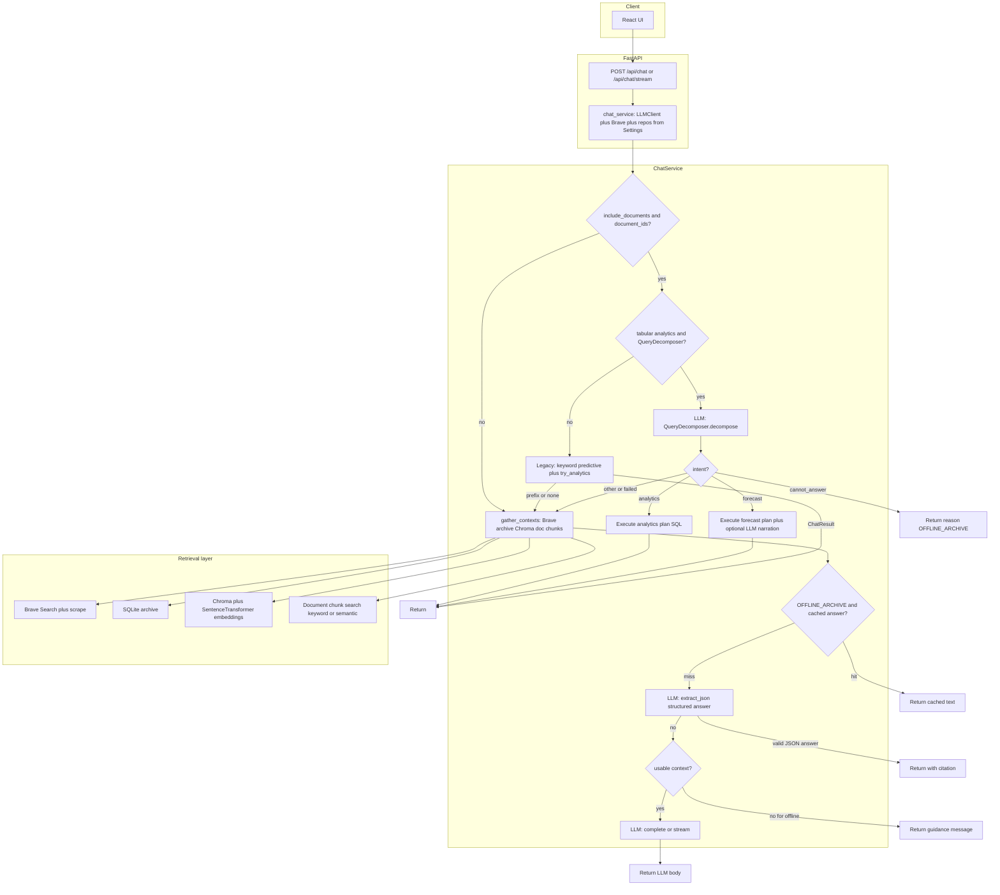

# Freshness Service

Local-first RAG system with:

- FastAPI backend
- React + Vite frontend
- LM Studio (OpenAI-compatible) for generation
- Brave Search for fresh web retrieval
- SQLite + optional ChromaDB for offline retrieval
- Deterministic tabular analytics for Excel documents
- Time-series forecasting for ingested spreadsheets with structured forecast + chart payloads for the UI

## Latest Project Changes

- Added predictive forecasting path: baseline linear-trend forecasts with optional `forecast` and Recharts-oriented `chart` on `POST /api/chat` and on SSE `meta`/`done` when ingested data and query intent match.
- Deterministic analytics answers are formatted as markdown via `backend/analytics/display_markdown.py`.
- Added deterministic tabular analytics for uploaded Excel files (`.xlsx`, `.xls`).
- Added analytics metadata migrations in `backend/migrations/`.
- Added typed analytics schema and dataset profiling support.
- Integrated analytics routing inside `ChatService`:
  - heuristic query routing (aggregation/list/filter intent),
  - restricted JSON planning,
  - validated execution over ingested sheet tables.
- Refactored backend into clearer layers: `domain`, `integrations`, `repositories`, `services`, and `analytics`.
- Expanded decoupled context-budget controls for web/document retrieval blending.

## What This Service Does

- Retrieves fresh web context at query time.
- Archives sources and supports offline recall.
- Lets you upload and chat with PDF/Excel documents.
- Streams chat responses over SSE.
- Runs deterministic spreadsheet analytics when document queries are tabular.
- Runs baseline time-series forecasting on ingested Excel when the query is predictive, returning structured forecast data and a chart spec for the frontend.

## Requirements

- Python 3.10+ (3.11 recommended)
- Node.js 18+ (for frontend)
- LM Studio with local server enabled
- Brave Search API key (for online retrieval)

Install backend dependencies:

```bash
pip install -r requirements.txt
playwright install
```

## Quick Start

1) Create and activate virtual environment:

```bash
# Windows (PowerShell)
python -m venv .venv
.venv\Scripts\Activate.ps1

# macOS/Linux
python -m venv .venv
source .venv/bin/activate
```

2) Set environment variables (via shell or `.env` file in repo root).

3) Start backend:

```bash
uvicorn backend.app:app --host 0.0.0.0 --port 8000
```

4) Start frontend:

Put **Node.js 18+** on your `PATH` once (new terminals pick it up automatically):

- Add your Node install’s `bin` directory to `~/.bashrc` or `~/.zshrc`, **or** use a version manager (nvm, fnm, mise).
- Example tarball layout under `~/.local` (Linux): prepend `$HOME/.local/node-v22.14.0-linux-x64/bin` to `PATH` in `~/.bashrc`, then run `source ~/.bashrc` or open a new terminal.

If Vite uses a port other than **5173** (because 5173 is busy), set **`CORS_ORIGINS`** to a comma-separated list that includes that origin (see **Environment Variables**).

```bash
cd frontend
npm install
npm run dev
```

Backend docs:

- Swagger: `http://localhost:8000/docs`
- ReDoc: `http://localhost:8000/redoc`
- OpenAPI: `http://localhost:8000/openapi.json`

## Architecture (Current)

```text
backend/
  app.py                  # FastAPI routes + startup + migrations
  config.py               # Environment settings + runtime overrides
  archive.py              # SQLite archive initialization
  documents.py            # PDF/Excel extraction + chunking + ingestion
  scraper.py              # Web scraping/clean text extraction
  freshness.py            # Freshness source checks
  vector_store.py         # Chroma upsert/query helpers
  domain/                 # Shared domain models/utilities
  integrations/           # LM Studio + Brave clients
  repositories/           # Archive/document/analytics data access
  services/               # Chat + health orchestration
  analytics/              # Routing, planning, forecasting, chart specs, validation, SQL compile, execution
  migrations/             # SQL migrations for analytics metadata

frontend/
  src/components/         # Chat/archive/documents/settings UI
  src/lib/                # API client + hooks + shared types/utilities
  src/store/              # Chat state
```

## Environment Variables

Core:

- `BRAVE_API_KEY`
- `LM_STUDIO_BASE_URL` (default: `http://localhost:1111/v1`)
- `MODEL_NAME` (default: `rnj-1`)
- `DB_PATH` (default: `knowledge.db`)
- `CORS_ORIGINS` (comma-separated browser origins; default: `http://localhost:5173`, `http://127.0.0.1:5173` — add e.g. `http://localhost:5174` if Vite picks the next port)
- `REQUEST_TIMEOUT_S` (default: `10`)

Retrieval:

- `MAX_SEARCH_RESULTS` (default: `3`)
- `MAX_CHARS_PER_SOURCE` (default: `2000`)
- `OFFLINE_RETRIEVAL_MODE` (`keyword` or `semantic`, default: `keyword`)
- `SEMANTIC_TOP_K` (default: `3`)
- `CHROMA_DIR` (default: `chroma_db`)
- `EMBED_MODEL_NAME` (default: `sentence-transformers/all-MiniLM-L6-v2`)

Decoupled RAG budgets:

- `WEB_TOP_K` (default: `3`)
- `DOC_SEMANTIC_TOP_K` (default: `12`)
- `DOC_KEYWORD_TOP_K` (default: `20`)
- `WEB_MAX_CHARS` (default: `2000`)
- `DOC_MAX_CHARS` (default: `0`, unlimited)
- `TOTAL_CONTEXT_BUDGET` (default: `14000`)
- `WEB_BUDGET_FRACTION` (default: `0.4`)

Document processing:

- `UPLOAD_DIR` (default: `uploads`)
- `MAX_UPLOAD_MB` (default: `25`)

Tabular analytics:

- `ENABLE_TABULAR_ANALYTICS` (default: `true`)
- `ANALYTICS_GROUPBY_TOP_N_DEFAULT` (default: `50`)

## Models and chat request flow

### How models are chosen

There is **no ranking, routing, or automatic selection** among multiple candidate models at runtime. Configuration is explicit:

| Role | Mechanism | Default |
| --- | --- | --- |
| **Chat / reasoning LLM** | `MODEL_NAME` in [`backend/config.py`](backend/config.py) → `Settings.model_name` → every OpenAI-compatible `/chat/completions` call in [`backend/integrations/llm_client.py`](backend/integrations/llm_client.py) | `rnj-1` |
| **LM Studio endpoint** | `LM_STUDIO_BASE_URL` in [`backend/config.py`](backend/config.py) | `http://localhost:1111/v1` |
| **Embedding model (RAG)** | `EMBED_MODEL_NAME` → Chroma [`SentenceTransformerEmbeddingFunction`](backend/vector_store.py) | `sentence-transformers/all-MiniLM-L6-v2` |
| **Baseline forecasts** | Fixed algorithm: [`sklearn.linear_model.LinearRegression`](backend/analytics/forecaster.py) on prepared time series (not env-selectable) | — |

Details:

- The **chat model id must match** what LM Studio exposes for loaded models. The backend does not pick a model from `/models`; that endpoint is only used for [health checks](backend/integrations/llm_client.py).
- **`LLMClient` is built per request** in [`chat_service()`](backend/api/deps.py) from `get_settings()`, so `POST /api/config` updates to `model_name` (see [`ConfigUpdate`](backend/api/schemas.py)) apply on the next chat call.
- **`EMBED_MODEL_NAME`** is used for all Chroma work in [`gather_contexts` / document retrieval](backend/services/chat/context.py) and [document ingestion](backend/api/routers/documents.py). It is **not** in `ConfigUpdate`, so embeddings are effectively **environment-driven** (or test overrides), unlike `model_name` in the settings API.
- **`OFFLINE_RETRIEVAL_MODE`** (`keyword` vs `semantic`) controls **whether** embedding search runs for web archive and document fallbacks, not **which** embedding model; the model name always comes from `EMBED_MODEL_NAME`.

The same configured LLM is used for JSON-oriented helpers, e.g. [`QueryDecomposer`](backend/analytics/query_decomposer.py) and [`extract_json`](backend/integrations/llm_client.py) inside [`ChatService.get_answer`](backend/services/chat_service.py).

### Request flow (high level)

Non-streaming and streaming share the same branches; streaming emits SSE (`meta`, `token`, `done`, `error`) instead of a single JSON body.



Sequence (matches the diagram):

1. **Request** hits [`backend/api/routers/chat.py`](backend/api/routers/chat.py); [`chat_service()`](backend/api/deps.py) builds `ChatService` with `LLMClient(base_url, model_name, timeout)` from [`get_settings()`](backend/config.py).
2. **Document-scoped path** (`include_documents` and `document_ids`): when tabular analytics and metadata exist, **QueryDecomposer** calls the LLM for intent (`forecast` / `analytics` / `cannot_answer`). Success yields deterministic analytics or forecast output (forecast may add **LLM narration** via `AnalyticsChatRunner`).
3. **Legacy analytics** if the decomposer path is unavailable: keyword **predictive** routing and **`try_analytics`** may return before RAG.
4. **`gather_contexts`** ([`backend/services/chat/context.py`](backend/services/chat/context.py)): **online** (Brave + scrape + optional Chroma upsert when `offline_retrieval_mode == semantic`) and **offline** web (keyword SQLite vs semantic Chroma), plus **document** hybrid retrieval (intent-based exact search, then semantic or keyword chunks). **`prefer_mode`** and **`include_web`** drive ONLINE vs OFFLINE vs LOCAL_WEIGHTS.
5. **Optional** metadata outline when RAG is empty but a spreadsheet summary exists ([`_augment_contexts_with_document_summary`](backend/services/chat_service.py)).
6. **OFFLINE_ARCHIVE**: try a **cached answer** from the archive.
7. **LLM `extract_json`**: structured answer from contexts; on success may **persist** to the archive in ONLINE mode.
8. If needed, **`complete`** or **`stream`** with the full RAG prompt; ONLINE may **save** the final answer to the archive.

### Key files

- Settings and env: [`backend/config.py`](backend/config.py)
- LLM calls: [`backend/integrations/llm_client.py`](backend/integrations/llm_client.py)
- Chat orchestration: [`backend/services/chat_service.py`](backend/services/chat_service.py)
- Retrieval and modes: [`backend/services/chat/context.py`](backend/services/chat/context.py)
- Embeddings / Chroma: [`backend/vector_store.py`](backend/vector_store.py)
- Runtime model URL and name via API: [`backend/api/routers/settings.py`](backend/api/routers/settings.py), [`backend/api/schemas.py`](backend/api/schemas.py) (`ConfigUpdate`)
- Forecast math: [`backend/analytics/forecaster.py`](backend/analytics/forecaster.py)

## API Endpoints

Core/chat:

- `GET /` - service info
- `POST /api/chat` - non-streaming chat response; may include optional `forecast` and `chart` when the predictive short-circuit applies
- `POST /api/chat/stream` - SSE chat stream; event shapes are described under **Chat response and SSE payloads** below

### Chat response and SSE payloads

**REST (`POST /api/chat`)**  
The JSON body matches the OpenAPI `ChatResponse` model. Fields `forecast` and `chart` are present only when the request hits the predictive forecasting path; they are omitted for normal RAG and for deterministic tabular analytics that do not produce a forecast.

**SSE (`POST /api/chat/stream`)**  
Event types: `meta`, `token`, `done`, `error`.

- **`meta`** — Always includes `mode`, `sources`, and `conversation_id`. Optionally includes:
  - `forecast` and `chart` on the predictive path (same shapes as the REST response).
  - `analytics_unavailable` — `{ "reason", "hint" }` when documents were in scope but tabular analytics could not run (normal RAG continues with this hint on the stream).
- **`token`** — `{ "text": "..." }` (answer fragments).
- **`done`** — Always includes `final_text`. On the predictive path, also includes `forecast` and `chart`.
- **`error`** — `{ "code", "message" }`.

**`sources` entries** may set `source_kind` to `web`, `document`, `analytics`, or `archive` (see the `Source` model in OpenAPI).

Archive:

- `GET /api/archive/search?q=...`
- `GET /api/archive/page/{url_hash}`

Documents:

- `POST /api/documents/upload`
- `GET /api/documents`
- `GET /api/documents/{document_id}`
- `DELETE /api/documents/{document_id}`

Settings/health:

- `GET /api/settings`
- `POST /api/config`
- `GET /api/health`

Freshness:

- `GET /api/freshness`
- `GET /api/freshness/{source_id}`
- `GET /api/freshness/sources/list`
- `POST /api/freshness/reload`

Legacy compatibility:

- `GET /freshness?query=...`

## Chat Request Shape

```json
{
  "query": "How many users signed up in 2020?",
  "conversation_id": "optional-id",
  "prefer_mode": "ONLINE",
  "include_web": true,
  "include_documents": true,
  "document_ids": ["optional-doc-id"]
}
```

Notes:

- If `include_documents=true` with scoped `document_ids`, **predictive** questions can short-circuit to the forecasting path (returning `forecast` and `chart`) before generic RAG, similar to the tabular analytics short-circuit.
- If `include_documents=true`, analytics routing can short-circuit normal RAG flow for spreadsheet-style (aggregation/list/filter) questions.
- If no context is available, mode falls back to `LOCAL_WEIGHTS`.

## Runtime Data

- `knowledge.db` (SQLite archive + document + analytics metadata)
- `knowledge.db-wal` / `knowledge.db-shm` (SQLite WAL sidecar files)
- `uploads/` (uploaded files)
- `chroma_db/` (if semantic mode is used)

## Testing

Tests need the same Python dependencies as the app (Pydantic, FastAPI, pandas, etc.). **Do not rely on the system-wide `pytest` from apt** unless those packages are installed there; use a project virtualenv:

```bash
python3 -m venv .venv
.venv/bin/pip install -r requirements.txt
```

Run all tests:

```bash
.venv/bin/pytest -q
```

Deterministic analytics contract tests:

```bash
.venv/bin/pytest -q tests/test_analytics_deterministic.py
```

LLM end-to-end chat QA (rubric from `tests/test.md`, cases in `tests/qa_rubric.json`):

- Set `RUN_CHAT_LLM_E2E=1`.
- Provide a workbook: copy your file to `tests/fixtures/Advanced_Sales_Dataset.xlsx`, or set `FRESHNESS_QA_WORKBOOK` to an absolute path.
- **LM Studio must accept HTTP from the same machine (or WSL host) that runs pytest.** Before tests, the fixture probes `GET {LM_STUDIO_BASE_URL}/models`.
- Set `LM_STUDIO_BASE_URL` to the exact base URL from LM Studio’s **Local Server** tab (typically ends with `/v1`). The app default is `http://localhost:1111/v1`; LM Studio often uses **port `1234`**, e.g. `http://127.0.0.1:1234/v1`.
- Set `MODEL_NAME` to a model id that server exposes (must match what `/v1/models` lists for loaded models).
- **WSL2:** if LM Studio runs on Windows, `localhost` inside Linux may not reach it. Use the Windows host IP (see `nameserver` in `/etc/resolv.conf`), e.g. `http://172.22.32.1:1234/v1`.
- Optional: `SKIP_LLM_HEALTHCHECK=1` to skip the probe (not recommended unless you know connectivity is fine).

```bash
export LM_STUDIO_BASE_URL=http://127.0.0.1:1234/v1
export MODEL_NAME=your-model-id-from-lm-studio
RUN_CHAT_LLM_E2E=1 .venv/bin/pytest -q tests/test_chat_rubric_llm_e2e.py
```

Without `RUN_CHAT_LLM_E2E`, those tests are skipped so default `pytest` runs stay offline-friendly.

If you set `RUN_CHAT_LLM_E2E=1` but all rubric tests **skip**, the workbook is missing: add `tests/fixtures/Advanced_Sales_Dataset.xlsx` or set `FRESHNESS_QA_WORKBOOK`. Run `pytest -rs` to print skip reasons.

## Security Notes

- Treat web/document content as untrusted input.
- Prompt-injection defenses are applied in prompts, but source text can still be adversarial.
- Do not upload sensitive files unless your local machine/storage is secured.

## Troubleshooting

- `ModuleNotFoundError: No module named 'pydantic'` (or similar) when running pytest: you are using a Python that does not have `requirements.txt` installed—typically system `pytest` from apt. Create `.venv`, run `.venv/bin/pip install -r requirements.txt`, and invoke `.venv/bin/pytest`.
- LM Studio unreachable during **chat rubric** tests: confirm Local Server is **running**; align `LM_STUDIO_BASE_URL` with the shown URL (often `:1234/v1`, not `:1111`). On **WSL2** with LM Studio on Windows, use the Windows host IP, not `localhost`. Quick check: `curl -sS "$LM_STUDIO_BASE_URL/models" | head`. Set `MODEL_NAME` to an id from that response. Use `SKIP_LLM_HEALTHCHECK=1` only to bypass the test probe.
- Brave search failures: verify `BRAVE_API_KEY`.
- Empty web extraction: target page may block scraping or require heavy JS.
- Upload errors: verify file extension and `MAX_UPLOAD_MB`.
- Analytics not triggering: ensure `ENABLE_TABULAR_ANALYTICS=true` and query has tabular intent (count/list/filter/grouping).
- Forecast or `chart` missing: requires ingested forecast artifacts on the selected documents, a predictive-style question, `include_documents=true`, and `document_ids` set. For analytics behavior and contracts, see `tests/test_analytics_deterministic.py`.
